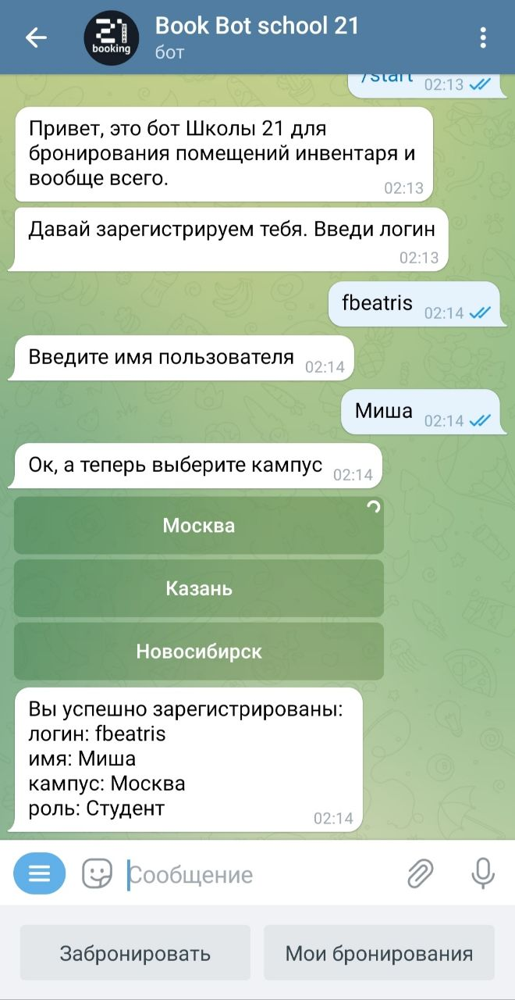

# Booking bot
Телеграм бот для бронирования помещений и инвентаря для внутреннего пользования в "Школе 21". Но его легко можно настроить под конкретные потребности.

Используется Spring IoC, Spring JDBC, MySQL

Реализованы две роли:

- Пользователь – может просматривать список доступных объектов,свободное время каждого и забронировать объект. Также может посмотреть свои брони и отменить.
 
- Администратор (доступ с паролем) – весь функционал пользователя, плюс возможность добавлять, редактировать и удалять объекты для бронирования.

Команды бота разделены по классам, реализующим общий интерфейс, так что можно легко добавлять новые пользовательские сценарии, не изменяя имеющиеся классы.
Работа с базой данных отделена от бизнес-логики с помощью паттерна «Репозиторий».

Регистрация нового пользователя. Сохраняется в базу данных вместе с Telegram user id.

